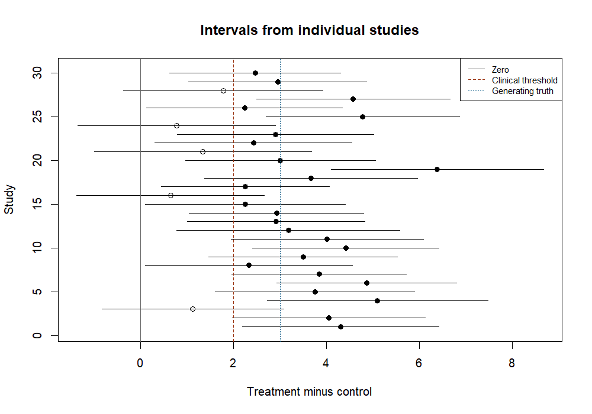
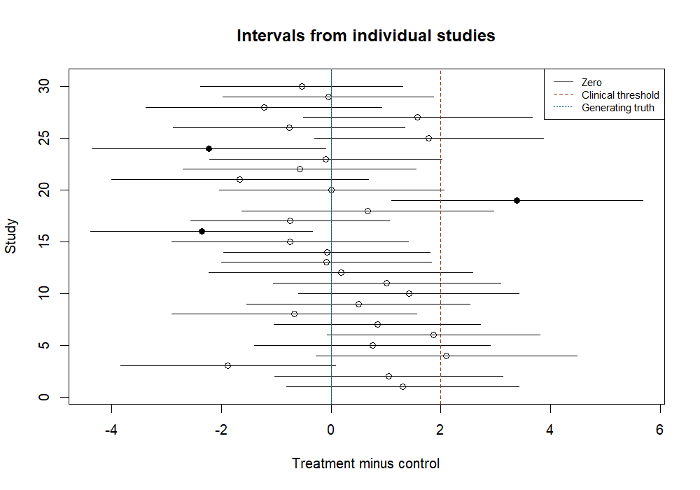
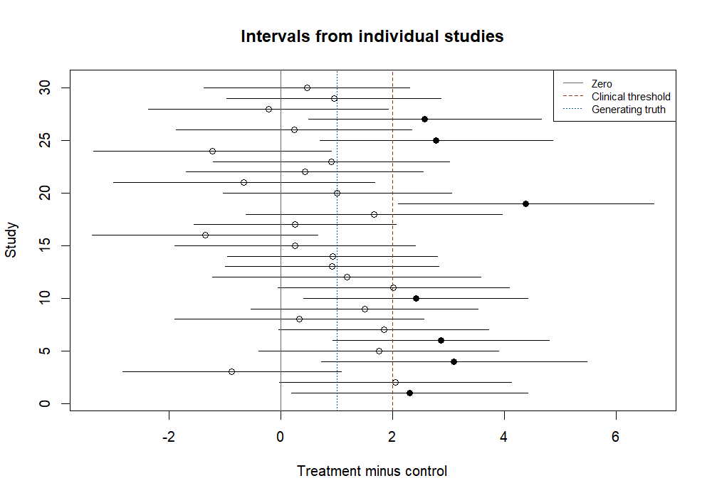
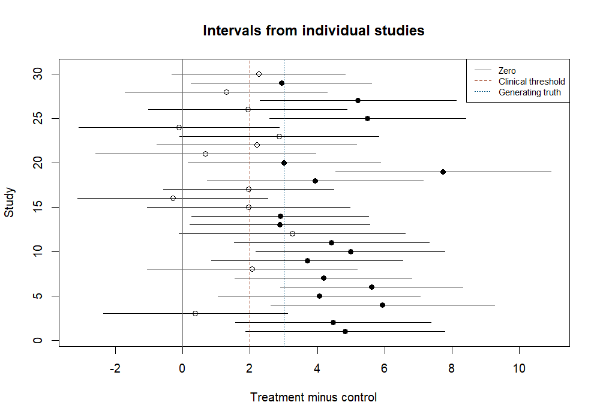
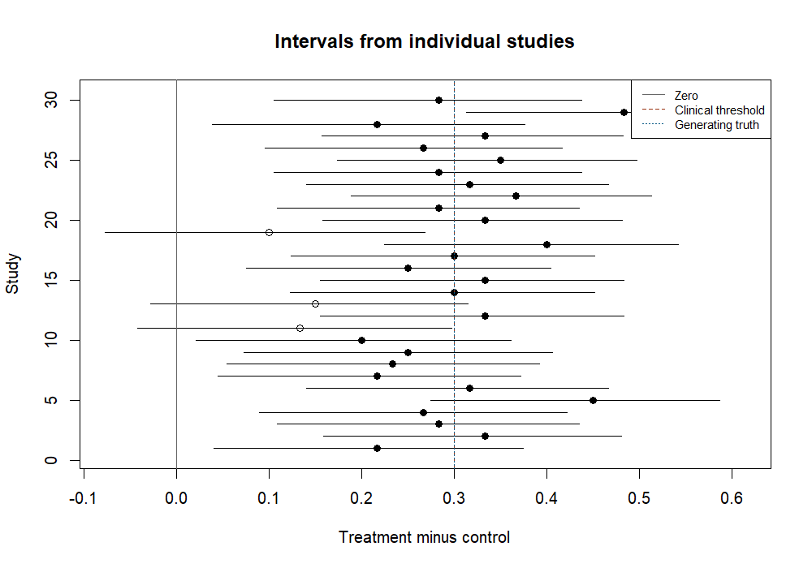

# Static sample size activity

Use these prepared synthetic results when the live app is unavailable. No code is required. All studies use equal allocation and a two-sided alpha of .05. Full reproducible results and assumptions accompany the activity.

## Before viewing the results

1. Predict how a smaller effect or larger SD changes power at 45 per group.
2. Explain the difference between the 3-unit planning effect and 2-unit clinical threshold.
3. Predict what changes if replications increase while participants per study remain fixed.

## planned

Participants per group: 45; generating difference: 3; SD (normal outcome): 5; B: 1000; seed: 20260914.

### One study

| estimate| lower|  upper| p_value|  width|reject |cover |width_met |
|--------:|-----:|------:|-------:|------:|:------|:-----|:---------|
|   2.3097| 0.048| 4.5714|  0.0454| 4.5235|TRUE   |TRUE  |FALSE     |

The test rejects a zero difference. The interval excludes zero in the beneficial direction, but includes benefits below the clinical threshold. Interpret uncertainty in context; this is not a prespecified equivalence or non-inferiority test.

### Repeated studies

|measure               | estimate|   MCSE| MC_lower_95| MC_upper_95|
|:---------------------|--------:|------:|-----------:|-----------:|
|Rejection rate        |    0.798| 0.0127|      0.7720|      0.8217|
|CI coverage           |    0.941| 0.0075|      0.9246|      0.9540|
|Full width target met |    0.315| 0.0147|      0.2870|      0.3445|

Mean FULL interval width: 4.15.

[Assumptions](../data/static_activity/planned_assumptions.csv) | [All replications](../data/static_activity/planned_replications.csv)

## null

Participants per group: 45; generating difference: 0; SD (normal outcome): 5; B: 1000; seed: 20260914.

### One study

| estimate|  lower|  upper| p_value|  width|reject |cover |width_met |
|--------:|------:|------:|-------:|------:|:------|:-----|:---------|
|  -0.6903| -2.952| 1.5714|  0.5457| 4.5235|FALSE  |TRUE  |FALSE     |

The test does not reject a zero difference; this does not establish no effect. The interval does not extend to the specified beneficial threshold; consider the full interval, including possible harm. Interpret uncertainty in context; this is not a prespecified equivalence or non-inferiority test.

### Repeated studies

|measure               | estimate|   MCSE| MC_lower_95| MC_upper_95|
|:---------------------|--------:|------:|-----------:|-----------:|
|Rejection rate        |    0.059| 0.0075|      0.0460|      0.0754|
|CI coverage           |    0.941| 0.0075|      0.9246|      0.9540|
|Full width target met |    0.315| 0.0147|      0.2870|      0.3445|

Mean FULL interval width: 4.15.

[Assumptions](../data/static_activity/null_assumptions.csv) | [All replications](../data/static_activity/null_replications.csv)

## smaller effect

Participants per group: 45; generating difference: 1; SD (normal outcome): 5; B: 1000; seed: 20260914.

### One study

| estimate|  lower|  upper| p_value|  width|reject |cover |width_met |
|--------:|------:|------:|-------:|------:|:------|:-----|:---------|
|   0.3097| -1.952| 2.5714|  0.7862| 4.5235|FALSE  |TRUE  |FALSE     |

The test does not reject a zero difference; this does not establish no effect. The interval includes both zero or harm and clinically important benefit. Interpret uncertainty in context; this is not a prespecified equivalence or non-inferiority test.

### Repeated studies

|measure               | estimate|   MCSE| MC_lower_95| MC_upper_95|
|:---------------------|--------:|------:|-----------:|-----------:|
|Rejection rate        |    0.167| 0.0118|      0.1452|      0.1914|
|CI coverage           |    0.941| 0.0075|      0.9246|      0.9540|
|Full width target met |    0.315| 0.0147|      0.2870|      0.3445|

Mean FULL interval width: 4.15.

[Assumptions](../data/static_activity/smaller_effect_assumptions.csv) | [All replications](../data/static_activity/smaller_effect_replications.csv)

## higher variability

Participants per group: 45; generating difference: 3; SD (normal outcome): 7; B: 1000; seed: 20260914.

### One study

| estimate|   lower| upper| p_value|  width|reject |cover |width_met |
|--------:|-------:|-----:|-------:|------:|:------|:-----|:---------|
|   2.0336| -1.1328|   5.2|  0.2052| 6.3329|FALSE  |TRUE  |FALSE     |

The test does not reject a zero difference; this does not establish no effect. The interval includes both zero or harm and clinically important benefit. Interpret uncertainty in context; this is not a prespecified equivalence or non-inferiority test.

### Repeated studies

|measure               | estimate|   MCSE| MC_lower_95| MC_upper_95|
|:---------------------|--------:|------:|-----------:|-----------:|
|Rejection rate        |    0.542| 0.0158|      0.5110|      0.5727|
|CI coverage           |    0.941| 0.0075|      0.9246|      0.9540|
|Full width target met |    0.000| 0.0000|      0.0000|      0.0038|

Mean FULL interval width: 5.81.

[Assumptions](../data/static_activity/higher_variability_assumptions.csv) | [All replications](../data/static_activity/higher_variability_replications.csv)

## binary

Participants per group: 60; generating difference: 0.3; SD (normal outcome): 5; B: 1000; seed: 20260914.

### One study

| estimate|  lower|  upper| p_value|  width|reject |cover |width_met |
|--------:|------:|------:|-------:|------:|:------|:-----|:---------|
|     0.25| 0.0717| 0.4072|   0.006| 0.3355|TRUE   |TRUE  |FALSE     |

The test rejects a zero difference. The interval excludes zero in the beneficial direction, but includes benefits below the clinical threshold. Interpret uncertainty in context; this is not a prespecified equivalence or non-inferiority test.

### Repeated studies

|measure               | estimate|   MCSE| MC_lower_95| MC_upper_95|
|:---------------------|--------:|------:|-----------:|-----------:|
|Rejection rate        |    0.919| 0.0086|      0.9004|      0.9344|
|CI coverage           |    0.956| 0.0065|      0.9414|      0.9671|
|Full width target met |    0.000| 0.0000|      0.0000|      0.0038|

Mean FULL interval width: 0.328.

[Assumptions](../data/static_activity/binary_assumptions.csv) | [All replications](../data/static_activity/binary_replications.csv)

## Interpretation and communication

Use the case template to justify the goal and assumptions. Explain one inconclusive result, interpret intervals against the clinical threshold, and compare performance while n stays fixed. Report Monte Carlo uncertainty separately from clinical uncertainty.

The normal batch uses equivalent sufficient-statistic sampling; the single dataset is a separate realisation, not the batch's first row. These displays include test/CI differences for binary data described in statistical_methods.md.

## References

See [References](../documentation/references.md) for the pedagogical and statistical sources.
