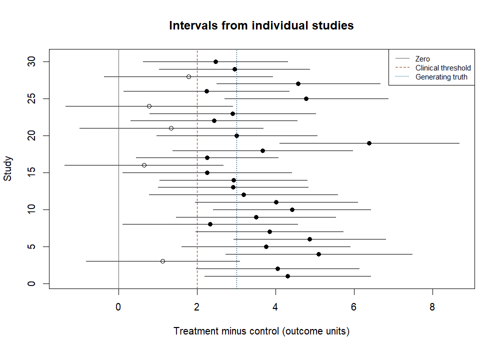
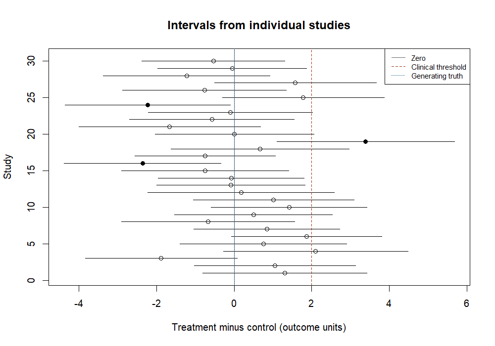
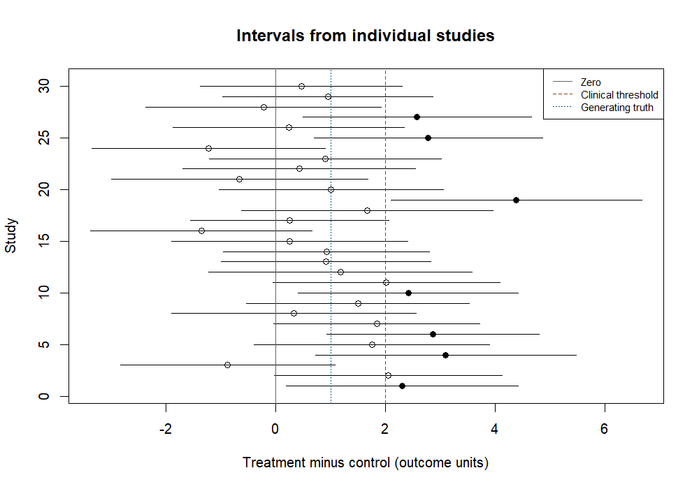
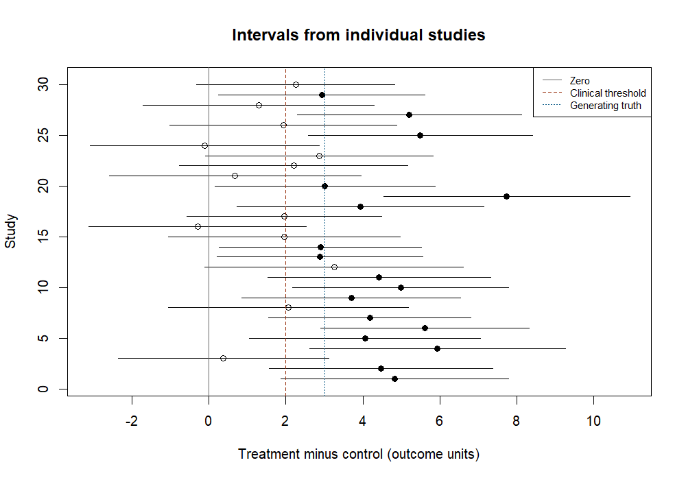
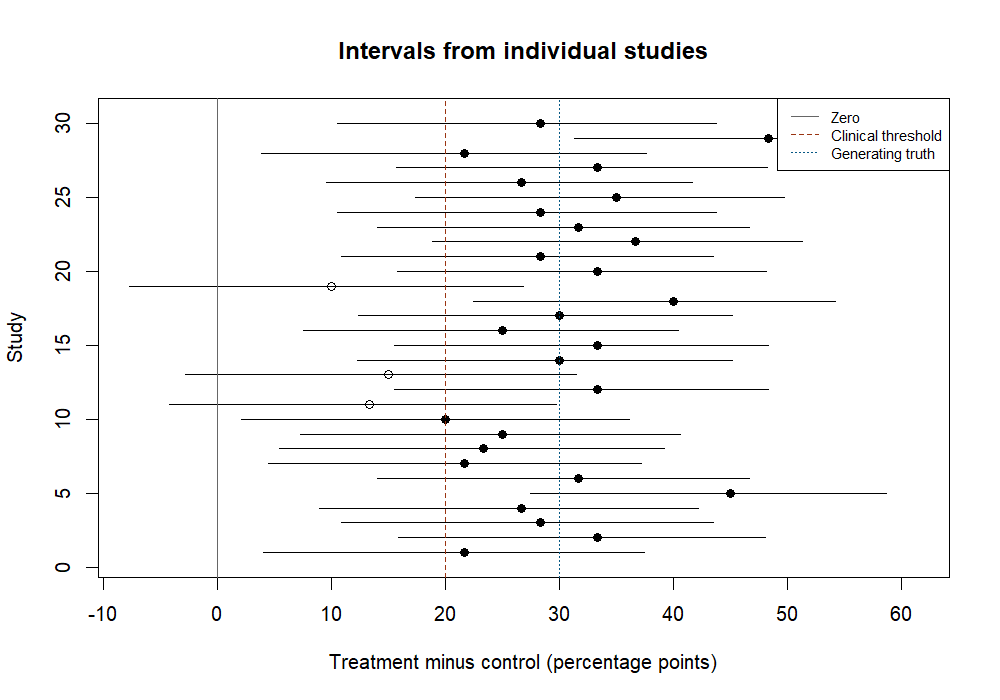

# Static sample size activity

Use these prepared synthetic results when the live app is unavailable. All studies use equal allocation and a two-sided Type I error rate of 5%. Full reproducible results and assumptions accompany the activity.

## Before viewing the results

1. Predict how a smaller effect or larger SD changes power at 45 per group.
2. Explain the distinct roles of the expected difference of 4 units, 3-unit target difference and 2-unit clinical threshold. For the binary trial, these values are 40, 30 and 20 percentage points respectively.
3. Predict what changes if replications increase while participants per study remain fixed.

## planned

Expected difference: 4 units; original target difference: 3 units; clinical threshold: 2 units.

Participants per group: 45; generating difference: 3 units; SD: 5; B: 1000; seed: 20260914.

### One study

Table 1. Estimate, confidence interval and decisions from one simulated study under the planned scenario.

| estimate| lower|  upper| p_value|  width|reject |cover |width_met |
|--------:|-----:|------:|-------:|------:|:------|:-----|:---------|
|   2.3097| 0.048| 4.5714|  0.0454| 4.5235|TRUE   |TRUE  |FALSE     |

The test rejects a zero difference. The interval excludes zero in the beneficial direction, but includes benefits below the clinical threshold. Interpret uncertainty in context; this is not a prespecified equivalence or non-inferiority test.

### Repeated studies

Table 2. Rejection, confidence interval coverage and full-width attainment across 1000 independent studies under the planned scenario. Monte Carlo intervals describe simulation uncertainty.

|Measure               |Rate  |Monte Carlo SE (percentage points) |95% lower limit |95% upper limit |
|:---------------------|:-----|:----------------------------------|:---------------|:---------------|
|Rejection rate        |79.8% |1.27                               |77.2%           |82.2%           |
|CI coverage           |94.1% |0.75                               |92.5%           |95.4%           |
|Full width target met |31.5% |1.47                               |28.7%           |34.4%           |

Mean FULL interval width: 4.15 units.

Figure 1. First 30 simulated intervals under the planned scenario. Filled points reject zero; the separate lines mark zero, the clinical threshold and the generating truth. The horizontal scale is outcome units.

[Assumptions](../data/static_activity/planned_assumptions.csv) | [All replications](../data/static_activity/planned_replications.csv)

## null

Expected difference: 4 units; original target difference: 3 units; clinical threshold: 2 units.

Participants per group: 45; generating difference: 0 units; SD: 5; B: 1000; seed: 20260914.

### One study

Table 3. Estimate, confidence interval and decisions from one simulated study under the null scenario.

| estimate|  lower|  upper| p_value|  width|reject |cover |width_met |
|--------:|------:|------:|-------:|------:|:------|:-----|:---------|
|  -0.6903| -2.952| 1.5714|  0.5457| 4.5235|FALSE  |TRUE  |FALSE     |

The test does not reject a zero difference; this does not establish no effect. The interval does not extend to the specified beneficial threshold; consider the full interval, including possible harm. Interpret uncertainty in context; this is not a prespecified equivalence or non-inferiority test.

### Repeated studies

Table 4. Rejection, confidence interval coverage and full-width attainment across 1000 independent studies under the null scenario. Monte Carlo intervals describe simulation uncertainty.

|Measure               |Rate  |Monte Carlo SE (percentage points) |95% lower limit |95% upper limit |
|:---------------------|:-----|:----------------------------------|:---------------|:---------------|
|Rejection rate        |5.9%  |0.75                               |4.6%            |7.5%            |
|CI coverage           |94.1% |0.75                               |92.5%           |95.4%           |
|Full width target met |31.5% |1.47                               |28.7%           |34.4%           |

Mean FULL interval width: 4.15 units.

Figure 2. First 30 simulated intervals under the null scenario. Filled points reject zero; the separate lines mark zero, the clinical threshold and the generating truth. The horizontal scale is outcome units.

[Assumptions](../data/static_activity/null_assumptions.csv) | [All replications](../data/static_activity/null_replications.csv)

## smaller effect

Expected difference: 4 units; original target difference: 3 units; clinical threshold: 2 units.

Participants per group: 45; generating difference: 1 units; SD: 5; B: 1000; seed: 20260914.

### One study

Table 5. Estimate, confidence interval and decisions from one simulated study under the smaller effect scenario.

| estimate|  lower|  upper| p_value|  width|reject |cover |width_met |
|--------:|------:|------:|-------:|------:|:------|:-----|:---------|
|   0.3097| -1.952| 2.5714|  0.7862| 4.5235|FALSE  |TRUE  |FALSE     |

The test does not reject a zero difference; this does not establish no effect. The interval includes both zero or harm and clinically important benefit. Interpret uncertainty in context; this is not a prespecified equivalence or non-inferiority test.

### Repeated studies

Table 6. Rejection, confidence interval coverage and full-width attainment across 1000 independent studies under the smaller effect scenario. Monte Carlo intervals describe simulation uncertainty.

|Measure               |Rate  |Monte Carlo SE (percentage points) |95% lower limit |95% upper limit |
|:---------------------|:-----|:----------------------------------|:---------------|:---------------|
|Rejection rate        |16.7% |1.18                               |14.5%           |19.1%           |
|CI coverage           |94.1% |0.75                               |92.5%           |95.4%           |
|Full width target met |31.5% |1.47                               |28.7%           |34.4%           |

Mean FULL interval width: 4.15 units.

Figure 3. First 30 simulated intervals under the smaller effect scenario. Filled points reject zero; the separate lines mark zero, the clinical threshold and the generating truth. The horizontal scale is outcome units.

[Assumptions](../data/static_activity/smaller_effect_assumptions.csv) | [All replications](../data/static_activity/smaller_effect_replications.csv)

## higher variability

Expected difference: 4 units; original target difference: 3 units; clinical threshold: 2 units.

Participants per group: 45; generating difference: 3 units; SD: 7; B: 1000; seed: 20260914.

### One study

Table 7. Estimate, confidence interval and decisions from one simulated study under the higher variability scenario.

| estimate|   lower| upper| p_value|  width|reject |cover |width_met |
|--------:|-------:|-----:|-------:|------:|:------|:-----|:---------|
|   2.0336| -1.1328|   5.2|  0.2052| 6.3329|FALSE  |TRUE  |FALSE     |

The test does not reject a zero difference; this does not establish no effect. The interval includes both zero or harm and clinically important benefit. Interpret uncertainty in context; this is not a prespecified equivalence or non-inferiority test.

### Repeated studies

Table 8. Rejection, confidence interval coverage and full-width attainment across 1000 independent studies under the higher variability scenario. Monte Carlo intervals describe simulation uncertainty.

|Measure               |Rate  |Monte Carlo SE (percentage points) |95% lower limit |95% upper limit |
|:---------------------|:-----|:----------------------------------|:---------------|:---------------|
|Rejection rate        |54.2% |1.58                               |51.1%           |57.3%           |
|CI coverage           |94.1% |0.75                               |92.5%           |95.4%           |
|Full width target met |0.0%  |0.00                               |0.0%            |0.4%            |

Mean FULL interval width: 5.81 units.

Figure 4. First 30 simulated intervals under the higher variability scenario. Filled points reject zero; the separate lines mark zero, the clinical threshold and the generating truth. The horizontal scale is outcome units.

[Assumptions](../data/static_activity/higher_variability_assumptions.csv) | [All replications](../data/static_activity/higher_variability_replications.csv)

## binary

Expected difference: 40 percentage points; original target difference: 30 percentage points; clinical threshold: 20 percentage points.

Participants per group: 60; generating difference: 30 percentage points; control 30.0%, treatment 60.0%; B: 1000; seed: 20260914.

### One study

Table 9. Estimate, confidence interval and decisions from one simulated study under the binary scenario.

|estimate               |lower                 |upper                  | p value|width                  |reject |cover |width met |
|:----------------------|:---------------------|:----------------------|-------:|:----------------------|:------|:-----|:---------|
|25.0 percentage points |7.2 percentage points |40.7 percentage points |   0.006|33.5 percentage points |TRUE   |TRUE  |FALSE     |

The test rejects a zero difference. The interval excludes zero in the beneficial direction, but includes benefits below the clinical threshold. Interpret uncertainty in context; this is not a prespecified equivalence or non-inferiority test.

### Repeated studies

Table 10. Rejection, confidence interval coverage and full-width attainment across 1000 independent studies under the binary scenario. Monte Carlo intervals describe simulation uncertainty.

|Measure               |Rate  |Monte Carlo SE (percentage points) |95% lower limit |95% upper limit |
|:---------------------|:-----|:----------------------------------|:---------------|:---------------|
|Rejection rate        |91.9% |0.86                               |90.0%           |93.4%           |
|CI coverage           |95.6% |0.65                               |94.1%           |96.7%           |
|Full width target met |0.0%  |0.00                               |0.0%            |0.4%            |

Mean FULL interval width: 32.8 percentage points.

Figure 5. First 30 simulated intervals under the binary scenario. Filled points reject zero; the separate lines mark zero, the clinical threshold and the generating truth. The horizontal scale is percentage points.

[Assumptions](../data/static_activity/binary_assumptions.csv) | [All replications](../data/static_activity/binary_replications.csv)

## Interpretation and communication

Use the case template to justify the goal and assumptions. Explain one inconclusive result, interpret intervals against the clinical threshold, and compare performance while n stays fixed. Report Monte Carlo uncertainty separately from clinical uncertainty.

The normal batch uses equivalent sufficient-statistic sampling; the single dataset is a separate realization, not the batch's first row. These displays include test/CI differences for binary data described in statistical_methods.md.

## References

See [References](../documentation/references.md) for the pedagogical and statistical sources.
